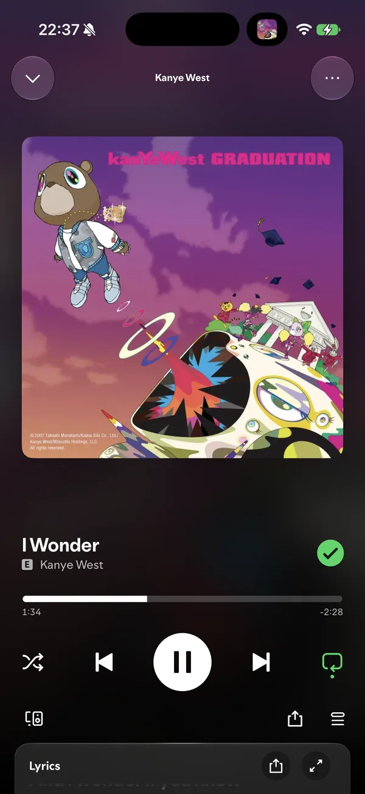
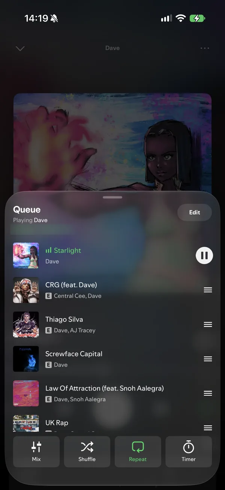
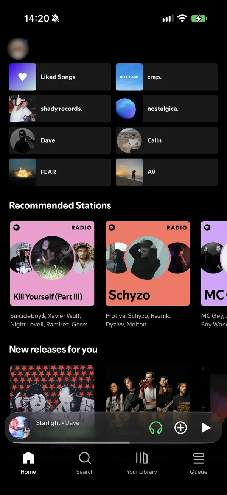
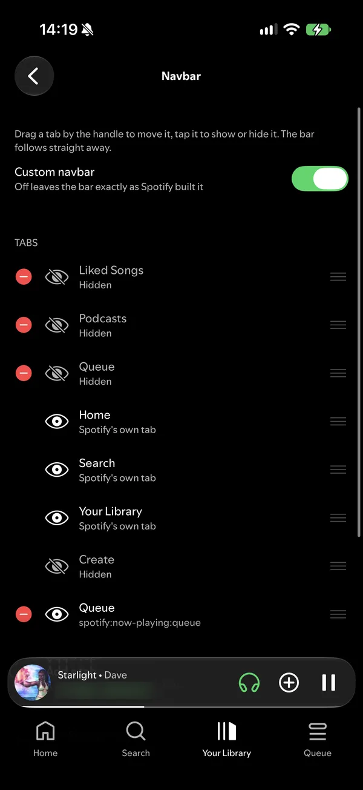
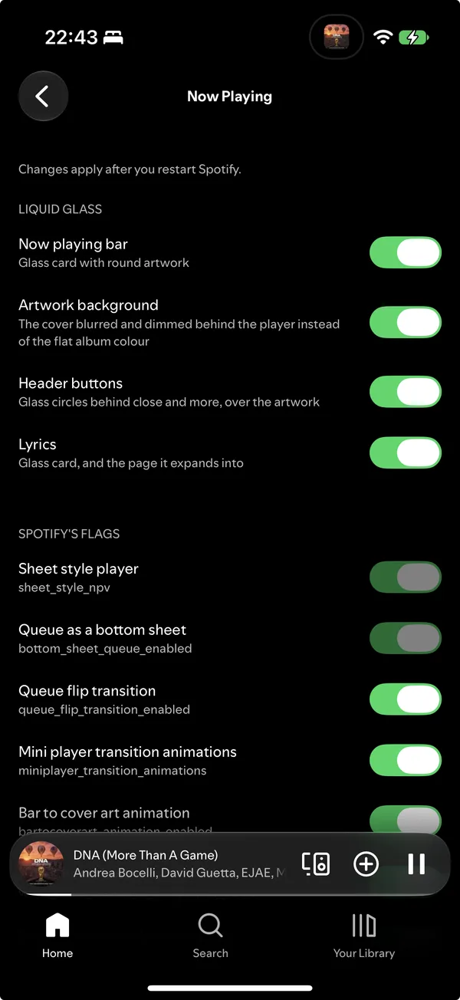

  

<h1 align="center">spoti.pw</h1>

Spotify, in glass.

  
  
  
  
  

  <a href="https://spoti.pw">spoti.pw</a> ·
  <a href="#get-it">Get it</a> ·
  <a href="#build-it-yourself">Build it yourself</a> ·
  <a href="docs/tweaks.md">Hack on it</a>

  
  
  
  
  

A Theos tweak that rebuilds the Spotify iOS app in Liquid Glass. One dylib, injected into a
decrypted Spotify IPA and signed with your own certificate, so it runs on a stock iPhone with no
jailbreak. Every piece sits behind its own switch in Settings → Mod Settings.

- Spotify's own Liquid Glass, every flag of it on at once
- Glass now playing bar, player header, search field and lyrics card
- Pure black AMOLED, and a Home gradient in any of eight colours
- A tab bar you reorder, hide and add any `spotify:` link to
- Queue as a bottom sheet, swipe a row to play next
- Like and dislike back on the lock screen widget, animated artwork on it
- Speed control and trim silence for music, not only podcasts
- Picture in picture, in the app and out of it
- No ad on app open, no upsells, no tooltips, no DJ badge
- EeveeSpotify's ad blocking, ported: ad services, upsells and a Premium product state, each behind its own switch
- Telemetry blocked, with a count of what it stopped
- Hide anything: Home shortcuts, playlist header, player buttons and the cards under them
- Unreleased features Spotify built and never shipped
- Every remote-config flag Spotify ships, searchable, Auto / Off / On

Cosmetic until asked otherwise. The Ad blocking page holds EeveeSpotify's layers, every one off by default;
the Premium one rewrites what the server says about the account, is the part Spotify's takedowns have
gone after, and is untested here.

## Get it

No IPA is distributed in this repo. [spoti.pw](https://spoti.pw) carries the current build, and
it is also a source for SideStore, AltStore and Feather: add `https://spoti.pw` and later builds
arrive on their own. Mod Settings → Updates checks the same place.

The app keeps Spotify's own bundle id, `com.spotify.client`, so it installs over the real Spotify
rather than next to it. That is deliberate: a rewritten bundle id has to match the App ID of the
profile you sign with, and this build cannot know which profile that will be. Sign a mismatched
pair and the app installs fine, but tapping the now playing card on the lock screen opens nothing.

### Signing it yourself

Which is what you have to watch for. Feather does not touch the bundle id unless you tell it to, so
with a certificate whose App ID is fixed you end up with exactly that mismatched pair: set
**Identifier** in Feather's signing options to the App ID shown in its certificates tab, and leave
**PPQ protection** off, since it appends a random string to the bundle id and breaks the match
again. AltStore, SideStore and Sideloadly register an App ID from the bundle id themselves and need
none of this.

You do not have to work out which of the two you got. A build the lock screen cannot open says so
once on its first launch, and carries a red row at the top of Mod Settings for as long as it lasts;
either one names the bundle id to sign under and copies it to the clipboard.

## Build it yourself

You bring a decrypted Spotify IPA of your own. Either way the result is an unsigned
`Spotify-<version>-glass.ipa` to sign with SideStore, Feather or any certificate signer.

### On GitHub, no Mac needed

Fork this repo, enable Actions in the fork, and run the **Build IPA from your own Spotify IPA**
workflow. It asks for a direct link to your decrypted `.ipa` (filebin.net, Dropbox, a host of
your own), builds the tweak, injects it, and hands the IPA back as a workflow artifact, or on
filebin.net if you pick that. The link is masked in the run's log and the result lives only in
your fork.

### On a Mac

Theos in `~/theos` with an iPhoneOS SDK in `~/theos/sdks`, plus:

    brew install make ldid dpkg zsign ideviceinstaller libimobiledevice
    uv tool install "cyan @ git+https://github.com/asdfzxcvbn/pyzule-rw"

Put the decrypted `.ipa` in `ipa/`, then:

    make release    # out/Spotify-<version>-glass.ipa, ready to sign
    make install    # the same, signed with your certificate and pushed to the iPhone over USB

`make install` reads `SIGN_P12`, `SIGN_PROFILE` and `SIGN_P12_PASSWORD` from `.signing.env`; copy
`.signing.env.example` and fill it in. It signs under the App ID of your profile, which is what keeps
the lock screen player working; `BUNDLE_ID=` overrides the bundle id, and is only safe when you know
it equals that App ID.

The first build spends about a minute reading Spotify's remote-config flags out of your IPA into
`tweak/Sources/Features/Flags/SGFlagList.m`, so the flag list always matches the Spotify you built from. Later builds
reuse it; `make flags` regenerates it.

## Mod Settings

Settings → Mod Settings is one page per area: Appearance (with Navbar under it), Home & Library,
Playlist and Player; Ads & privacy and Labs; then All flags and Mod, which holds the version,
updates, links, the welcome tour and the reset. A switch on a page forces one of Spotify's flags;
off leaves Spotify's own value, and All flags is where a flag goes back to Auto. Navbar applies
straight away, everything else after Spotify restarts.

## Hack on it

[docs/tweaks.md](docs/tweaks.md): the layout of the tweak, the other make targets, how the view
trees are recorded off the phone, and how to add a tweak of your own.

## Credits

[cyan](https://github.com/asdfzxcvbn/pyzule-rw) does the injection, [Theos](https://theos.dev)
builds the tweak, and [FLEX](https://github.com/FLEXTool/FLEX), as hopeless's AutoFLEX build in
`vendor/`, is the in-app inspector the view trees are read through.

GPL-3.0. Not affiliated with Spotify.
